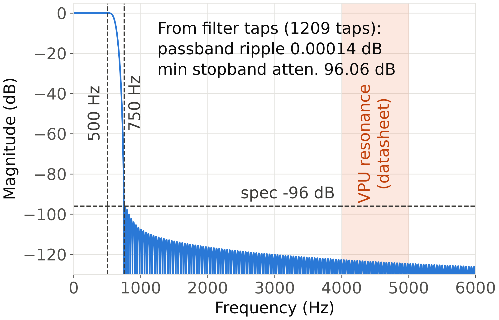
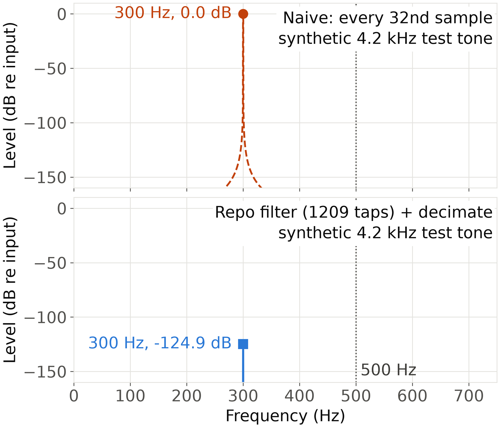

# everyday-objects-sensing

AI Design Catalog prototype (live site): https://lucaslombanaarias.github.io/everyday-objects-sensing/

## everyday_sensing (Python package): Development

These instructions are only for the `everyday_sensing` Python package in `src/everyday_sensing/`, not the rest of the repository.

Install (from the repo root, ideally in a virtual environment):

```
pip install -r requirements.txt
```

Run lint and tests:

```
ruff check .
pytest -q
```

Regenerate the decimation filter report in `results/decimation_filter/`:

```
python -m everyday_sensing.filter_report
```

Regenerate the slide figures in `docs/figures/`:

```
python scripts/plot_filter_figures.py
```

## Decimation filter figures

Recordings are captured at 48 kHz and decimated by 32 to 1,500 Hz through a linear-phase Kaiser FIR (passband edge 500 Hz, ripple <= 0.1 dB, attenuation >= 96 dB from 750 Hz). All numbers on the figures are computed from the designed taps.

Magnitude response of the filter against the spec, with the sensor's datasheet resonance band (4 to 5 kHz) shaded:



A synthetic 4.2 kHz tone decimated naively (top) folds to 300 Hz, inside the kept band; through the filter and `decimate()` (bottom) it is suppressed:


